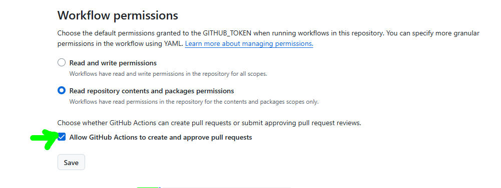

### Step0 How to Start This Exercise

- Please don't fork or don't clone this repository, instead  "Use This Template" button on the right side of this repository :   

<p align="center">
	
	<br>
	<sub><strong>Step 1:</strong> Select <strong>Use this template</strong>, then <strong>Create a new repository</strong>.</sub>
</p>

- For **Owner** select the organization name provided to you by instructor. Give a specific, unique name to your repository so it'll be easier for you to find if needed : ) 

<p align="center">
	
	<br>
	<sub><strong>Step 2:</strong> Choose an owner, enter a unique repository name, and create the repository.</sub>
</p>

- Cross-check if "Allow all actions and reusable workflows" is enabled in your repository from Settings => Actions => General

<p align="center">
	
	<br>
	<sub><strong>Step 3:</strong> Confirm that <strong>Allow all actions and reusable workflows</strong> is selected.</sub>
</p>

- Scroll down in settings page and "Allow GitHub Actions to create and approve pull requests"

<p align="center">
	
	<br>
	<sub><strong>Step 4:</strong> Enable <strong>Allow GitHub Actions to create and approve pull requests</strong>, then click <strong>Save</strong>.</sub>
</p>


# Step1  Setup Your Environment

### Highly Recommended: Please use the pre-configured Github Codespace for today's workshop.


1. Right click the button below to open the **Create Codespace** page in a new tab.

   [](https://codespaces.new/mburakunuvar/skills-agentic-workflows-that-read-the-room?quickstart=1)


   No need to change options, we'll use the default configuration.

2. Confirm the **Repository** field is your copy of the exercise, not the original template, then click the green **Create Codespace** button.
   - ✅ Your copy: `/your-org/skills-agentic-workflows-that-read-the-room`
   - ❌ Original: `/EmileVerbunt/AgenticWorkflows`

3. Wait for Visual Studio Code to load in your browser. The codespace setup may take a few minutes while it installs dependencies. 

4. Get familiar with the project by 

```bash
briefly explain #codespace 

```


# Step2  QuickStart with a pre-defined GitHub Agentic Workflows.

In this guide you will add an existing, pre-baked workflow to an existing GitHub repository where you are a maintainer 

[the automated Daily Repo Status Report](https://github.com/githubnext/agentics/blob/main/workflows/daily-repo-status.md?plain=1) is just one of many useful workflows that you can quickly implement to your repository.
 
 

### Install GitHub Agentic Workflows and Configure Codespaces

```bash
gh extension install github/gh-aw
gh aw init --codespaces
```

The initialization command prepares your repository for agentic workflows and
updates your copy of `.devcontainer/devcontainer.json` with your repository name
and the permissions required to run GitHub Actions workflows.

Commit and push this repository-specific configuration before rebuilding:

```bash
git add .
git commit -m "configure Codespaces for gh-aw"
git push origin main
```

1. Press `Ctrl+Shift+P` and select **Codespaces: Rebuild Container**.
2. Approve the requested repository permissions. Do not continue without
	authorizing them.
3. Wait for the Codespace to reconnect.

After the rebuild, verify that GitHub Agentic Workflows is available:

```bash
gh aw --version
```


### Add Your First Workflow from GitHub Agentics

```bash
$ gh aw add-wizard githubnext/agentics/daily-repo-status
```

<table>
	<tr>
		<td width="50%" align="center">
			<a href="images/daily-p1.png"></a>
			<br><sub><strong>1. Select GitHub Copilot CLI</strong></sub>
		</td>
		<td width="50%" align="center">
			<a href="images/daily-p2.png"></a>
			<br><sub><strong>2. Choose Copilot requests</strong></sub>
		</td>
	</tr>
	<tr>
		<td width="50%" align="center">
			<a href="images/daily-p3.png"></a>
			<br><sub><strong>3. Keep the daily schedule</strong></sub>
		</td>
		<td width="50%" align="center">
			<a href="images/daily-p5.png"></a>
			<br><sub><strong>4. Merge the generated pull request</strong></sub>
		</td>
	</tr>
</table>

```bash 
$ gh aw status 
$ git pull
$ git aw status 
```
 