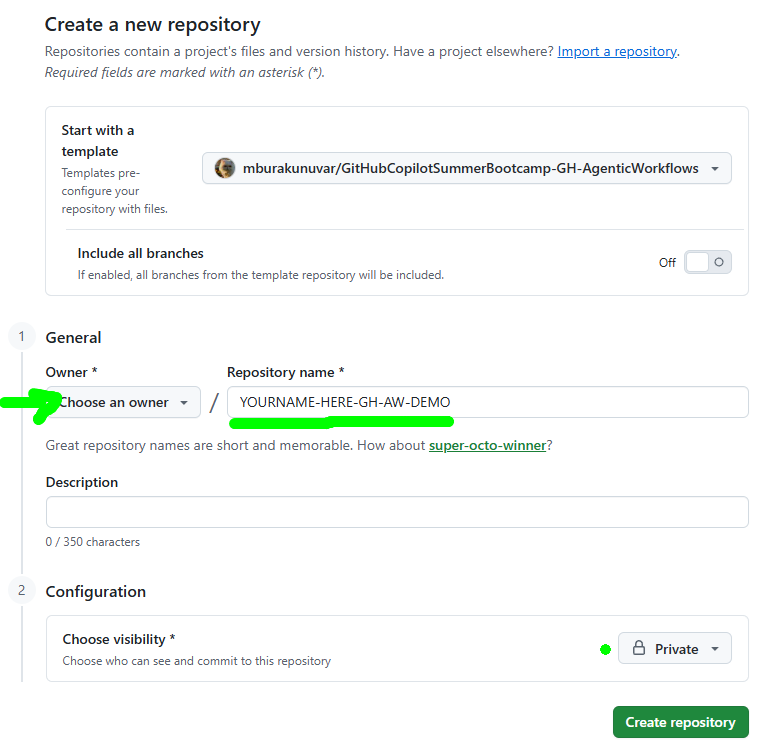
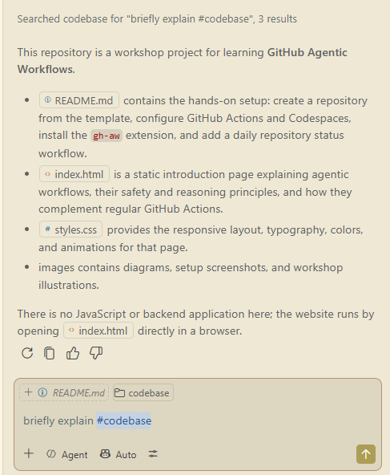
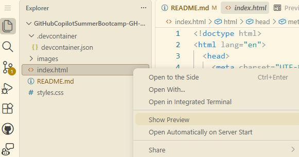
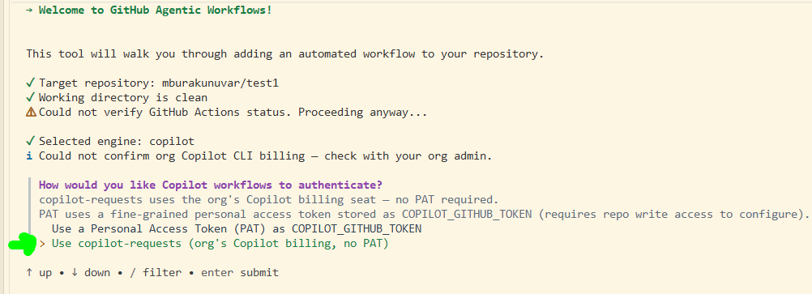
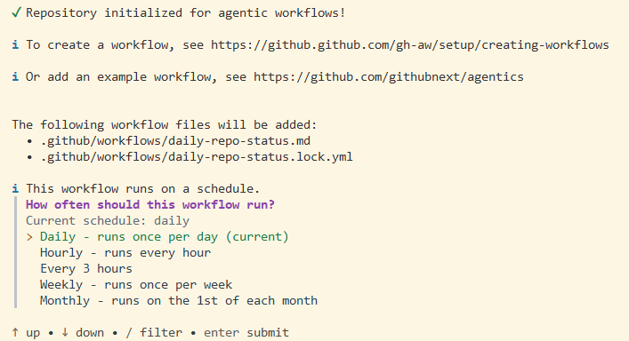
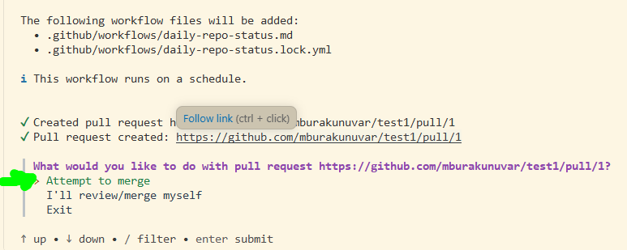
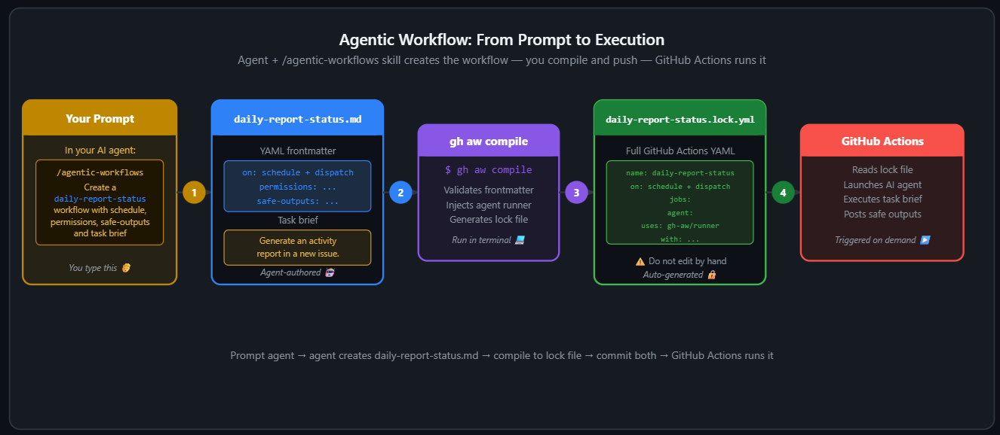

# GitHub Agentic Workflows Workshop

Build and run secure, AI-powered automations with GitHub Agentic Workflows
(`gh-aw`). You will install a pre-built workflow, create two workflows from
natural-language prompts, and review their results through pull requests.

## What are we going to automate today ? 

| # | Part | Outcome |
| :--: | --- | --- |
| 1 | Environment Setup | Create Repository and Configure Codespaces|
| 2 | Daily repo status | A pre-built workflow that runs on schedule |
| 3 | New day update | A custom workflow that updates the web app |
| 4 | Daily FAQ update | Another custom workflow that fetches content and adds data |
| 5 | Optional review | A `/grumpy` pull request review workflow |

> [!IMPORTANT]
> This workshop uses your organization's **Copilot requests** billing. If that
> option is unavailable or reported as disabled, stop and contact your
> instructor instead of creating a Personal Access Token (PAT).


## 1. Create Your Workshop Repository

Do not fork or clone this repository. Create a repository from the template so
your work is isolated from other students.

1. Select **Use this template**, then **Create a new repository**.

   <p align="center">
      
   </p>

2. For **Owner**, select the organization provided by your instructor. Enter a
   unique repository name, keep the default branch as `main`, and select
   **Create repository**.

   <p align="center">
      
   </p>

3. In the new repository, open **Settings > Actions > General** and confirm:

   - **Allow all actions and reusable workflows** is selected.
   - **Allow GitHub Actions to create and approve pull requests** is selected.

   Select **Save** if you changed either setting. If an organization policy
   prevents a change, contact your instructor.


## 2. Open the Repository in GitHub Codespaces

1. On the repository page, select **Code**, open the **Codespaces** tab, and
   select **Create codespace on main**. Keep the default settings.

   <p align="center">
      
   </p>

2. Wait for Visual Studio Code and the development container to finish loading.
   Initial setup may take a few minutes.

3. If Workspace Trust appears, trust the repository and continue.

   <p align="center">
      
   </p>

### Explore the Project

In Copilot Chat, try these prompts without asking Copilot to make changes:

```text
Briefly explain #codebase.
```

```text
Are there any agentic workflows in this repository? Do not take any action.
```

<p align="center">
   
</p>

To preview the sample site, right-click `index.html` and select
**Open with Live Server**.

<p align="center">
   
</p>

The sample application uses HTML, CSS, and JavaScript, but Agentic Workflows can
run in projects built with any language, framework, or runtime.

## 3. Install and Initialize `gh-aw`

Run the following commands in the Codespace terminal:

```bash
gh extension install github/gh-aw
gh aw version 
#  should be something like v0.85.4
unset GH_TOKEN GITHUB_TOKEN
gh auth login --web --scopes repo,workflow
gh auth status
gh aw version
```

> [!TIP]
> If `gh-aw` is already installed, replace the first command with
> `gh extension upgrade gh-aw`.

During `gh auth login`:

| Step | Where | Action |
| :--: | --- | --- |
| **1** | Terminal | Select **HTTPS** as the preferred Git protocol. |
| **2** | Terminal | Select **Yes** when asked to authenticate Git. |
| **3** | Terminal | Copy the one-time code, then press **Enter**. |
| **4** | Browser | Continue with your signed-in account and enter the code. |
| **5** | Browser | Select **Authorize GitHub CLI**. |
| **6** | Terminal | Wait for the successful authentication message. |

> [!NOTE]
> The `unset` command makes GitHub CLI use your browser-authenticated > session instead of the restricted token injected by Codespaces. In > every new terminal,
> run this command again before using `gh` or `gh aw`:

Initialize Agentic Workflows, then commit the generated repository
configuration:

```bash
gh aw init
git add .
git commit -m "initialize GitHub Agentic Workflows"
git push origin main
```

> [!STATUS UPDATE---SO FAR SO GOOD!]
> This push triggers the **Part 2 readiness** workflow. Wait for
> it to finish in the repository's **Actions** tab, then update your Codespace:

```bash
git pull --ff-only origin main
```

> [!TIP]
> If **Agentic Workflows Agent** does not appear in Copilot Chat, open the
> Command Palette and run **Developer: Reload Window**.

## 4. Add and Run the Daily Repo Status Workflow

Install the
[Daily Repo Status Report](https://github.com/githubnext/agentics/blob/main/workflows/daily-repo-status.md?plain=1):

```bash
gh aw add-wizard githubnext/agentics/daily-repo-status
```

Use these selections when prompted:

| # | Prompt | Selection |
| :--: | --- | --- |
| 1 | Coding agent | **GitHub Copilot CLI** |
| 2 | Authentication | **Copilot requests** |
| 3 | Schedule | **Daily** |
| 4 | Create a setup pull request, if offered | **Yes** |
| 5 | Setup pull request action | **Attempt to merge** |

Selecting **Copilot requests** makes the wizard add
`copilot-requests: write` to the workflow automatically. No PAT or
`COPILOT_GITHUB_TOKEN` secret is required.

<table>
   <tr>
      <td width="50%" align="center">
         <a href="images/daily-p1.png"></a>
         <br><sub><strong>1. Select GitHub Copilot CLI</strong></sub>
      </td>
      <td width="50%" align="center">
         <a href="images/daily-p2.png"></a>
         <br><sub><strong>2. Choose Copilot requests</strong></sub>
      </td>
   </tr>
   <tr>
      <td width="50%" align="center">
         <a href="images/daily-p3.png"></a>
         <br><sub><strong>3. Keep the daily schedule</strong></sub>
      </td>
      <td width="50%" align="center">
         <a href="images/daily-p5.png"></a>
         <br><sub><strong>4. Attempt to merge the setup pull request</strong></sub>
      </td>
   </tr>
</table>

The wizard creates and compiles
`.github/workflows/daily-repo-status.md`, opens a setup pull request, and
updates your local default branch after the pull request is merged. It may also
offer to start the first run.

If you skipped the initial run, start it manually:

```bash
gh aw status
gh aw run daily-repo-status
```

Open the repository's **Actions** tab to follow the run. When it succeeds, open
the **Issues** tab and find the new issue whose title starts with
`[repo-status]`.

<p align="center">
   
</p>


## 5. Create a Custom Workflow for Daily Updates on App

1. In Copilot Chat, select the **Agentic Workflows Agent**.

2. Submit this prompt:

   ```text
   Create .github/workflows/new-day.md as an Agentic Workflow Markdown file.

   Requirements:
   - Use the Copilot engine.
   - Run once per day and on demand with workflow_dispatch.
   - Grant contents: read and copilot-requests: write permissions.
   - Enable file editing with tools.edit.
   - Use safe-outputs.create-pull-request so changes are proposed through a
     pull request and never written directly to main.
   - Use the workflow run's UTC date.
   - In index.html, add that date to the existing Daily Updates navigation and
     add a matching accessible dialog that confirms the daily update ran.
   - Follow the existing HTML structure, ID conventions, date wording, and
     styling. Do not modify styles.css unless it is necessary.
   - Do not duplicate a date, navigation control, or dialog. If the UTC date is
     already present, make no change.
   - Preserve every existing daily update.
   - Validate the workflow with gh aw validate new-day.
   - Do not compile the workflow.
   ```

3. Review the generated Markdown, then validate, compile, commit, and run it:

   ```bash
   gh aw validate new-day
   gh aw compile .github/workflows/new-day.md
   git add .github/workflows/new-day.md .github/workflows/new-day.lock.yml
   git commit -m "add daily website update workflow"
   git push origin main
   gh aw run new-day
   ```

4. Follow the run in the **Actions** tab. Review and merge the pull request it
   creates, then update your Codespace without creating a merge commit:

   ```bash
   git pull --ff-only origin main
   ```

   Complete this step before creating the next workflow so both workflows start
   from the same version of `index.html`.

> [!NOTE]
> Agentic workflow Markdown files (`.md`) are the source of truth. Their
> `.lock.yml` files are generated GitHub Actions workflows. Never edit a
> `.lock.yml` file manually; run
> `gh aw compile .github/workflows/FILENAME.md` after changing its Markdown
> source, then commit both files.


## 6. Create another Custom Workflow Highlights

1. In Copilot Chat, keep **Agentic Workflows Agent** selected.

2. Submit this prompt:

   ```text
   Create .github/workflows/highlights-of-day.md as an Agentic Workflow Markdown
   file.

   Requirements:
   - Use the Copilot engine.
   - Run every six hours and on demand with workflow_dispatch.
   - Grant contents: read and copilot-requests: write permissions.
   - Enable tools.edit and tools.web-fetch.
   - Fetch the GitHub Agentic Workflows FAQ:
     https://github.github.com/gh-aw/reference/faq/ 
   - Select one FAQ that is not already represented in index.html.
   - Use the workflow run's UTC date. 
   - Add required network allowed
   - Add the selected question and a concise, accurate answer to the matching
     Daily Updates dialog in index.html. If that date already has a placeholder
     dialog, reuse it; otherwise add a matching navigation control and dialog.
   - Match the existing HTML structure, ID conventions, date wording, and
     styling. Preserve all existing updates.
   - Never duplicate a date, navigation control, dialog, or FAQ. If today's
     dialog already contains an FAQ, or no unused FAQ remains, make no change.
   - Use safe-outputs.create-pull-request so changes are proposed through a
     pull request and never written directly to main.
   - Validate the workflow with gh aw validate highlights-of-day.
   - Do not compile the workflow.
   ```

3. Review the generated Markdown, then validate, compile, commit, and run it:

   ```bash
   gh aw validate highlights-of-day
   gh aw compile .github/workflows/highlights-of-day.md
   git add .github/workflows/highlights-of-day.md .github/workflows/highlights-of-day.lock.yml
   git commit -m "add daily FAQ workflow"
   git push origin main
   gh aw run highlights-of-day
   ```

4. Follow the run in the **Actions** tab, then review and merge its pull
   request. A later run on the same UTC day should not create a duplicate
   update.


> [!NOTE]
> ### What Is a Safe Output?
>
> A safe output is a controlled GitHub write operation declared under
> `safe-outputs:`. The agent remains read-only and requests a narrowly configured
> operation that a separate, permission-controlled job validates and performs.
>
> | Safe output | What it can do | Example use |
> | --- | --- | --- |
> | `create-issue` | Open a new issue | Report a test-quality gap |
> | `add-comment` | Comment on an issue or pull request | Review changed tests |
> | `create-pull-request` | Propose file changes in a pull request | Update stale documentation |
> | `add-labels` | Add allowed labels | Triage incoming issues |
>
> `noop` is always available. Use it when the workflow succeeds but finds
> nothing useful to change.
>
> #### Configuration Examples
>
> **Create an issue:**
>
> ```yaml
> safe-outputs:
>    create-issue:
>       title-prefix: "[quality] "
>       max: 1
> ```
>
> **Add a comment:**
>
> ```yaml
> safe-outputs:
>    add-comment:
>       max: 1
>       hide-older-comments: true
> ```
>
> **Create a pull request:**
>
> ```yaml
> safe-outputs:
>    create-pull-request:
>       draft: true
>       allowed-files:
>          - "**/*.md"
>       max: 1
> ```


## 7. Optional: Add the Grumpy Reviewer

The
[Grumpy Reviewer](https://github.com/githubnext/agentics/blob/main/docs/grumpy-reviewer.md)
is an on-demand workflow that reviews changed lines in a pull request and posts
up to five focused comments.

Install it from a clean working tree:

```bash
gh aw add-wizard githubnext/agentics/grumpy-reviewer
```

Choose **GitHub Copilot CLI**, **Copilot requests**, and **Attempt to merge**
when prompted. After the setup pull request is merged, open any pull request
and add one of these comments:

```text
/grumpy
```

```text
/grumpy focus on security
```

```text
/grumpy check error handling especially
```

## Troubleshooting

| Problem | Resolution |
| --- | --- |
| `gh` uses the restricted Codespaces token | Run `unset GH_TOKEN GITHUB_TOKEN` in the current terminal. |
| `add-wizard` reports a dirty working tree | Commit the intended changes before rerunning the wizard. |
| Copilot requests is unavailable or returns `403` | Confirm the repository belongs to the instructor's organization, then contact the instructor to verify Copilot billing. |
| A workflow is missing or its lock file is stale | Run `git pull --ff-only origin main`, then `gh aw compile .github/workflows/FILENAME.md` and commit both workflow files. |
| A workflow cannot create a pull request | Recheck **Settings > Actions > General**, or ask the instructor whether an organization policy blocks pull request creation. |

## References

- [GitHub Agentic Workflows documentation](https://github.github.com/gh-aw/) 
- [GH-AW-WORKSHOP](https://githubnext.github.io/gh-aw-workshop/#00-welcome)
- [`gh-aw` CLI reference](https://github.github.com/gh-aw/setup/cli/)
- [Workflow permissions](https://github.github.com/gh-aw/reference/permissions/)
- [Safe outputs](https://github.github.com/gh-aw/reference/safe-outputs/)

## Appendix

For personal-repository setup instructions, see the [Appendix](appendix.md).
